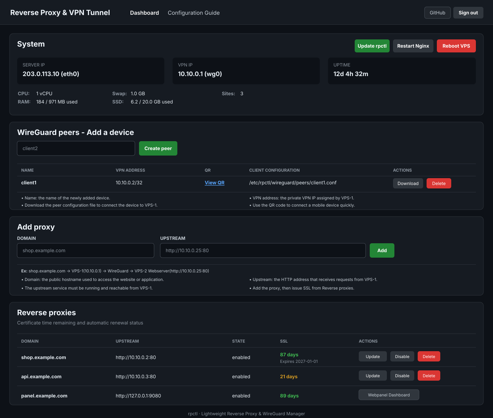

# rpctl — Reverse Proxy & VPN Tunnel

## Quick Install

### 1. VPS-1 — Reverse Proxy

This v1.0.5 installer supports **Ubuntu Server 22.04 LTS and 24.04 LTS** on `amd64` and `arm64`. Run this command on a clean VPS:

```bash
sudo apt update && sudo apt install -y ca-certificates curl git && git clone https://github.com/hgn389/Reverser-Proxy-WireGuard-Tunnel.git rpctl && cd rpctl && sudo bash scripts/install.sh
```

The same command is used on Ubuntu 22.04 and Ubuntu 24.04. If an existing checkout reports `Only Ubuntu Server 24.04 is supported`, it contains an installer older than v1.0.2. Update that checkout and confirm the corrected platform check before running it again:

```bash
cd ~/rpctl
git pull --ff-only origin main
grep -n 'ubuntu:22.04' scripts/install.sh
sudo bash scripts/install.sh
```

The `grep` command must show `ubuntu:22.04|ubuntu:24.04`. The installer then downloads the latest GitHub Release, so the repository owner must publish the v1.0.5 release assets before this installation is used.

Select **WireGuard private mode** in the installer. The VPS-2 client configuration will be created at:

```text
/etc/rpctl/wireguard/peers/client1.conf
```

### 2. Copy the configuration to VPS-2

Copy this file from VPS-1 to `/root/client1.conf` on VPS-2. Windows users can transfer it through **WinSCP**.

`client1.conf` contains a WireGuard private key. Never share it or upload it to GitHub.

### 3. VPS-2 — Website server or Orange Pi

Run these commands on VPS-2:

```bash
sudo apt update
sudo apt install -y --no-install-recommends wireguard-tools
sudo install -d -m 700 /etc/wireguard
sudo install -m 600 /root/client1.conf /etc/wireguard/wg0.conf
sudo systemctl enable --now wg-quick@wg0
sudo rm -f /root/client1.conf
```

### 4. Test the connection

Ping VPS-1 from VPS-2:

```bash
ping -c 4 10.10.0.1
```

Ping VPS-2 from VPS-1:

```bash
ping -c 4 10.10.0.2
```

If both commands receive replies, the WireGuard connection is ready. Open the management menu on VPS-1 with:

```bash
sudo rp
```

**Done.**

## Add VPS-3 Through VPS-N

Every additional website server needs its own WireGuard peer and client configuration. Never reuse one `.conf` file on multiple servers.

### 1. Create a new peer on VPS-1

Use one of these methods:

- Terminal menu: run `sudo rp`, select **13. WireGuard peers**, then **2. Add peer**.
- Web Panel: open **WireGuard peers - Add a device**, select **Create peer**, then download its client configuration.
- Command line:

  ```bash
  sudo rpctl wg peer add
  ```

Leaving the name empty creates the next available `clientN` name. For a default installation, the first additional peer normally produces:

```text
Name:          client2
VPN address:   10.10.0.3/32
Configuration: /etc/rpctl/wireguard/peers/client2.conf
```

List the assigned names and addresses at any time:

```bash
sudo rpctl wg peer list
```

### 2. Copy the new configuration to VPS-3

Copy this file from VPS-1:

```text
/etc/rpctl/wireguard/peers/client2.conf
```

Place it at `/root/client2.conf` on VPS-3. Windows users can download it from the Web Panel or transfer it with WinSCP. Treat the file like a password because it contains a private key.

### 3. Install WireGuard on VPS-3

Run these commands on VPS-3:

```bash
sudo apt update
sudo apt install -y --no-install-recommends wireguard-tools
sudo install -d -m 700 /etc/wireguard
sudo install -m 600 /root/client2.conf /etc/wireguard/wg0.conf
sudo systemctl enable --now wg-quick@wg0
sudo rm -f /root/client2.conf
```

If UFW is active and the website listens on port 80, allow VPS-1 through the WireGuard interface:

```bash
sudo ufw allow in on wg0 from 10.10.0.1 to any port 80 proto tcp
```

### 4. Test VPS-3

Run on VPS-3:

```bash
ip address show wg0
sudo wg show
ping -c 4 10.10.0.1
```

Run on VPS-1:

```bash
ping -c 4 10.10.0.3
```

When both servers respond, use the VPS-3 address as a reverse proxy upstream. For a website listening on port 80, enter:

```text
http://10.10.0.3:80
```

### 5. Repeat for VPS-4 through VPS-N

Run `sudo rpctl wg peer add` once for each new server, copy that peer's configuration to only that server, and repeat the VPS-3 installation commands with the new filename. With an unchanged default network and sequential allocation, the addresses normally begin as follows:

| Website server | Peer | VPN address |
|---|---|---|
| VPS-2 | `client1` | `10.10.0.2` |
| VPS-3 | `client2` | `10.10.0.3` |
| VPS-4 | `client3` | `10.10.0.4` |
| VPS-N | Next available peer | Next available address |

Deleted addresses may be reused, so always use the address shown by `sudo rpctl wg peer list` instead of guessing it.



## Supported systems and minimum hardware

Install the rpctl server only on the systems listed below. The installer rejects other operating systems rather than claiming untested compatibility.

| Item | Minimum | Recommended |
|---|---:|---:|
| Operating system | Ubuntu Server 22.04 LTS | Latest Ubuntu 24.04 point release |
| Architecture | `amd64` (x86_64) or `arm64` (aarch64) | `amd64` or `arm64` |
| CPU | 1 vCPU | 1–2 vCPU |
| RAM | 512 MB | 1 GB |
| Swap | 512 MB recommended on a 512 MB VPS | 1 GB |
| Free disk space | 2 GB after Ubuntu is installed | 5 GB or more |
| Access | A root account or a user with sudo | Root/sudo and a public IPv4 address |

The public rpctl server supports **Ubuntu Server 22.04 LTS and 24.04 LTS**. Debian, CentOS, AlmaLinux, Rocky Linux and other distributions have not been tested and are rejected by the installer.

An upstream website server may use another operating system. For example, an Orange Pi running Ubuntu, Debian or Armbian can serve websites behind VPS-1 as long as VPS-1 can reach its HTTP/HTTPS port through a public IP, LAN, WireGuard or Tailscale.

Required public ports are `80/tcp` and `443/tcp`. Keep the SSH port open. WireGuard uses `51820/udp` by default. Direct Web Panel access uses `9080/tcp` only when explicitly enabled.

## What rpctl does

rpctl is a small Nginx reverse proxy and VPN management tool. One static Go binary provides the `rpctl` command, the interactive `rp` terminal menu and the optional Web Panel.

- Manage multiple reverse proxy domains with independent HTTP or HTTPS upstreams.
- Test Nginx and roll back failed configuration changes.
- Issue and renew Let's Encrypt certificates through the optional acme.sh component.
- Bootstrap a WireGuard server and one initial client configuration.
- Create, list, inspect, download, and delete additional WireGuard peers.
- Detect WireGuard and Tailscale interface addresses.
- Optionally run a lightweight authenticated Web Panel.
- Install a newer checksum-verified GitHub Release from the CLI, terminal menu, or Web Panel.
- Run without Docker, a database, PHP, Node.js or a background CLI process.

The default minimal installation contains Nginx and the rpctl binary. The Web Panel, WireGuard and acme.sh are optional. Portable backup/restore commands are not implemented yet.

## Install on a clean Ubuntu 22.04 or 24.04 VPS

Before installation:

1. Create a fresh Ubuntu Server 22.04 LTS or 24.04 LTS VPS.
2. Confirm that you can run `sudo` and that the server can access GitHub.
3. Allow SSH plus ports `80/tcp` and `443/tcp` in the VPS provider firewall. Allow `51820/udp` if WireGuard will be used and `9080/tcp` if direct Web Panel access is required.
4. If you want SSL immediately, point the domain's A record to the VPS public IPv4 address.
5. Create a VPS snapshot when the provider supports it.

The installer downloads a precompiled binary from the latest GitHub Release and verifies `SHA256SUMS`. A Go compiler is not installed on the VPS. The GitHub repository must have a release containing `rpctl-linux-amd64`, `rpctl-linux-arm64` and `SHA256SUMS` before these commands can work.

The review-first method is recommended:

```bash
curl --proto '=https' --tlsv1.2 -fsSL https://raw.githubusercontent.com/hgn389/Reverser-Proxy-WireGuard-Tunnel/main/scripts/install.sh -o install.sh
less install.sh
sudo bash install.sh
```

One-line installation:

```bash
bash -o pipefail -c 'curl --proto "=https" --tlsv1.2 -fsSL https://raw.githubusercontent.com/hgn389/Reverser-Proxy-WireGuard-Tunnel/main/scripts/install.sh | sudo bash'
```

The installer reads interactive answers from `/dev/tty`, so the one-line command can still show prompts. It asks about these components:

| Prompt | Choose it when |
|---|---|
| WireGuard tools | The reverse proxy needs a private VPN path to another server |
| WireGuard private mode | Only the `10.10.0.0/24` private network should use the tunnel |
| WireGuard full-tunnel mode | All client Internet traffic should pass through VPS-1 |
| acme.sh | You need HTTPS certificates and automatic renewal; choose it when using a Web Panel domain |
| Web Panel | You want browser administration; the default is off to save RAM |
| UFW rules | You want the installer to allow the selected service ports |

After installation, verify the server and open the menu:

```bash
rpctl version
rpctl status
sudo rp
```

The SSH login banner also displays the server IP, VPN IP, Web Panel address and the `rp` menu command.

When the Web Panel is selected, the final bordered block shows its domain, direct IP address, username, the password entered during interactive setup, WireGuard client path, and terminal menu command. Save this information privately. Direct `http://IP:9080` access is enabled initially so the panel remains reachable while DNS or SSL is being prepared. Disable it later with menu item 12 when only domain access is desired.

For a noninteractive installation, download `install.sh` first and select every component explicitly:

```bash
sudo bash install.sh --wireguard-private --acme --no-web --open-firewall
sudo bash install.sh --wireguard-full --acme --no-web --open-firewall
sudo bash install.sh --wireguard --no-acme --no-web --no-firewall
sudo bash install.sh --no-wireguard --no-acme --no-web --no-firewall
```

`--wireguard` installs the tools without creating an interface. `--acme` installs a pinned, checksum-verified acme.sh release and its renewal timer; `--no-acme` skips that component on a clean installation. Rerunning the installer preserves an existing rpctl-managed acme.sh installation and timer. `--web` installs the Web Panel. Direct `IP:9080` access is enabled after a new Web Panel installation so the panel is immediately reachable. When a panel domain is entered, rpctl also checks its HTTP route and issues its HTTPS certificate automatically when DNS is ready. `--no-web` keeps the CLI-only installation. A skipped component can be added later. The GitHub Release binary is verified against `SHA256SUMS` before installation. The VPS does not need Go.

An interactive `--web` installation asks for the panel domain, admin username, and password through `/dev/tty`. For unattended installation, keep the password out of command arguments and environment variables by using a protected file:

```bash
read -r -s -p 'Web Panel password: ' rpctl_web_password; echo
printf '%s' "$rpctl_web_password" | sudo tee /root/rpctl-web-password >/dev/null
unset rpctl_web_password
sudo chmod 600 /root/rpctl-web-password
sudo env \
  RPCTL_WEB_DOMAIN=panel.example.com \
  RPCTL_WEB_USERNAME=admin \
  RPCTL_WEB_PASSWORD_FILE=/root/rpctl-web-password \
  bash install.sh --no-wireguard --acme --web --open-firewall
sudo rm -f /root/rpctl-web-password
```

The password file must be regular, have permissions `0600` or stricter, and contain 12–72 bytes. `rpctl wg status` shows the current WireGuard interface status.

## First reverse proxy: quick start

The example below publishes a website running at `http://192.0.2.20:8080` as `app.example.com`.

1. Confirm from VPS-1 that the upstream answers:

   ```bash
   curl -I -H 'Host: app.example.com' http://192.0.2.20:8080
   ```

2. Create an A record for `app.example.com` pointing to the public IPv4 address of VPS-1. During initial troubleshooting, a DNS-only Cloudflare record is simpler than a proxied record.

3. Open the menu and choose `3. Add proxy`:

   ```bash
   sudo rp
   ```

   Enter the complete upstream URL, including `http://` or `https://` and the port:

   ```text
   Domain: app.example.com
   Upstream (http://host:port): http://192.0.2.20:8080
   ```

4. Let the menu issue SSL when DNS is ready. You can also issue it later:

   ```bash
   sudo rpctl ssl issue app.example.com
   ```

5. Verify the public route:

   ```bash
   curl -I https://app.example.com
   rpctl ssl status app.example.com
   ```

The upstream may be a public address, private/LAN address, WireGuard address or Tailscale address. It does not have to be a VPN address, but it must be reachable from VPS-1.

## Important paths

| Path | Purpose |
|---|---|
| `/usr/local/bin/rpctl` | Main binary |
| `/usr/local/bin/rp` | Symlink that opens the terminal menu |
| `/etc/rpctl/sites/` | Canonical managed site definitions |
| `/etc/rpctl/web/config.json` | Web Panel settings and bcrypt password hash |
| `/etc/rpctl/certs/` | Managed certificates and private keys |
| `/etc/rpctl/wireguard/peers/` | Generated WireGuard client configurations |
| `/etc/rpctl/wireguard/peer-defaults.json` | Non-secret endpoint and route defaults used for new peers |
| `/etc/nginx/sites-available/` | Ubuntu-style Nginx server blocks |
| `/etc/nginx/sites-enabled/` | Enabled Nginx symlinks |
| `/var/lib/rpctl/rollback/` | Recent configuration rollback snapshots |

Do not commit `/etc/rpctl`, WireGuard client files, certificate keys or Web Panel runtime configuration to Git.

## Two-node deployment: VPS-1 reverse proxy and VPS-2 website server

Use this layout when the public VPS is only the Internet entry point and the website runs on another machine such as an Orange Pi 5 Plus:

```text
Visitor
   |
   | HTTPS
   v
Cloudflare (optional)
   |
   | HTTPS :443
   v
VPS-1: public Ubuntu 22.04/24.04 server
  Public IP: VPS1_PUBLIC_IP
  rpctl + Nginx + Let's Encrypt
  WireGuard: 10.10.0.1
   |
   | encrypted WireGuard tunnel
   | HTTP http://10.10.0.2:80
   v
VPS-2: Orange Pi 5 Plus website server
  WireGuard: 10.10.0.2
  aaPanel + Nginx/OpenLiteSpeed + website files
```

Install `rpctl` only on **VPS-1**. VPS-2/Orange Pi remains the website server and only needs its normal web server plus a WireGuard client when the private VPN route is used.

### 1. Install VPS-1 (public reverse proxy)

Download and review the installer as described above, then install the private WireGuard server, acme.sh, and the conservative UFW rules:

```bash
sudo bash install.sh \
  --wireguard-private \
  --acme \
  --open-firewall
```

The default private WireGuard setup creates:

```text
VPS-1 WireGuard address     10.10.0.1/24
VPS-2 client address        10.10.0.2/32
WireGuard UDP port          51820
VPS-2 client configuration  /etc/rpctl/wireguard/peers/client1.conf
```

Transfer `client1.conf` to the Orange Pi through a secure channel. This file contains a private key: keep it out of Git, chat messages, terminal logs, and public file shares.

### 2. Configure VPS-2 (Orange Pi 5 Plus)

On an Ubuntu/Debian-based Orange Pi, install only the WireGuard client tools:

```bash
sudo apt update
sudo apt install -y --no-install-recommends wireguard-tools
sudo install -d -m 700 /etc/wireguard
sudo install -m 600 client1.conf /etc/wireguard/wg0.conf
sudo systemctl enable --now wg-quick@wg0
```

Verify the interface and tunnel:

```bash
ip address show wg0
sudo wg show
ping -c 3 10.10.0.1
```

The expected Orange Pi address is `10.10.0.2/32`, and `wg show` should report a recent handshake.

In aaPanel, create the website using its real domain, for example `shop.example.com`, and serve it on HTTP port `80`. The aaPanel web server must listen on `10.10.0.2:80` or `0.0.0.0:80`. SSL is not required on the Orange Pi in this layout because the public TLS connection ends at VPS-1 and the private hop is already encrypted by WireGuard.

The Orange Pi does not need public router forwarding for ports 80 or 443. If its local firewall is active, allow VPS-1 to reach port 80 through WireGuard, for example:

```bash
sudo ufw allow in on wg0 from 10.10.0.1 to any port 80 proto tcp
```

### 3. Test VPS-1 to VPS-2 before adding a proxy

Run these commands on VPS-1:

```bash
ping -c 3 10.10.0.2
curl -I -H 'Host: shop.example.com' http://10.10.0.2:80
```

The `Host` header matters because aaPanel uses it to select the correct website when several domains share the same Orange Pi address and port. Continue only after the upstream returns a valid HTTP response such as `200`, `301`, or `302`.

### 4. Point DNS to VPS-1

Create the public DNS record for the website:

```text
Type    A
Name    shop.example.com (or @)
Value   VPS1_PUBLIC_IP
```

The record may be proxied through Cloudflare. DNS must point to the public address of VPS-1, never to the private WireGuard address `10.10.0.2`.

### 5. Add the reverse proxy on VPS-1

Open the menu with `rp`, choose `3. Add proxy`, and enter:

```text
Domain: shop.example.com
Upstream (http://host:port): http://10.10.0.2:80
```

The upstream value must always include all three parts:

```text
scheme://host:port
```

Valid examples:

```text
http://10.10.0.2:80
http://203.0.113.20:8080
https://backend.example.com:443
```

Invalid examples:

```text
10.10.0.2
10.10.0.2:80
http://10.10.0.2
```

`rpctl` intentionally does not guess the scheme or port. Requiring the complete value makes HTTP versus HTTPS explicit and keeps the stored configuration predictable.

After an interactive `3. Add proxy` succeeds, `rpctl` creates a short-lived HTTP-01 test token and requests it through the new domain. This verifies the complete public route, including proxied Cloudflare DNS, instead of comparing DNS addresses only. If the token returns from VPS-1, the menu offers to issue the SSL certificate immediately. If the check fails, the HTTP proxy remains installed and the menu prints the VPS-1 public IP with this reminder:

```text
The domain does not reach the reverse proxy IP, so SSL cannot be issued yet.
After updating DNS, issue SSL manually from menu item 9, SSL certificates.
```

DNS propagation, Cloudflare origin settings, provider firewalls, and ports 80/443 can all affect this check. The temporary token is removed after every successful or failed attempt.

The equivalent noninteractive command is:

```bash
sudo rpctl proxy add shop.example.com --upstream http://10.10.0.2:80
```

Multiple aaPanel websites may use the same upstream address:

```bash
sudo rpctl proxy add blog.example.com --upstream http://10.10.0.2:80
sudo rpctl proxy add shop.example.com --upstream http://10.10.0.2:80
```

VPS-1 preserves the original domain in the HTTP `Host` header, so aaPanel selects the matching virtual host.

### 6. Enable public HTTPS on VPS-1

Test the HTTP route first, replacing `VPS1_PUBLIC_IP`:

```bash
curl -I --resolve shop.example.com:80:VPS1_PUBLIC_IP http://shop.example.com
```

If the Add Proxy menu already issued SSL successfully, only check its status. Otherwise, issue the certificate manually on VPS-1 after DNS is ready:

```bash
sudo rpctl ssl issue shop.example.com
rpctl ssl status shop.example.com
curl -I https://shop.example.com
```

The resulting connection uses HTTPS from the visitor/Cloudflare to VPS-1 and HTTP inside the encrypted WireGuard tunnel to the Orange Pi. When Cloudflare is enabled, use **Full (Strict)** after the VPS-1 certificate is active.

### Troubleshooting the two-node route

Check each hop separately:

```bash
# On VPS-1: VPN reachability
ping -c 3 10.10.0.2

# On VPS-1: aaPanel virtual host on Orange Pi
curl -I -H 'Host: shop.example.com' http://10.10.0.2:80

# On VPS-1: generated Nginx configuration
sudo rpctl system nginx-test
rpctl proxy show shop.example.com

# Public HTTPS and certificate
rpctl ssl status shop.example.com
curl -I https://shop.example.com
```

A `502 Bad Gateway` usually means VPS-1 cannot reach the Orange Pi upstream or the aaPanel site is not listening on the configured port. A Cloudflare `522` means Cloudflare cannot connect to VPS-1; check ports 80/443, UFW, the provider firewall, Nginx, and SSL status on VPS-1.

## Use

```bash
rp
sudo rp
rpctl status
sudo rpctl proxy add app.example.com --upstream http://203.0.113.10:8080
sudo rpctl proxy add nas.example.com --upstream http://10.10.0.2:8080
rpctl proxy list
rpctl proxy list --quiet
rpctl proxy show app.example.com
sudo rpctl proxy edit app.example.com --upstream https://backend.example.com:8443
sudo rpctl proxy disable app.example.com
sudo rpctl proxy enable app.example.com
sudo rpctl proxy delete app.example.com
sudo rpctl ssl issue app.example.com
rpctl ssl status
sudo rpctl ssl renew app.example.com
sudo rpctl ssl disable app.example.com
rpctl web status
sudo rpctl web install
sudo rpctl web disable
sudo rpctl web enable
sudo rpctl system nginx-test
sudo rpctl system recover
sudo rpctl wg status
sudo rpctl wg peer list
sudo rpctl wg peer add
sudo rpctl wg peer add home-server
sudo rpctl wg peer show home-server
sudo rpctl wg peer delete home-server
```

The `rp` menu and `rpctl status` show the server interface addresses and detected WireGuard/Tailscale addresses. The menu redraws a bordered header after each operation so previous output remains visually separated from the next choices. Menu option `2. List proxy domains` shows every managed domain, and option `9. SSL certificates` opens certificate actions.

| Menu | Action |
|---:|---|
| 1 | Show service and network status |
| 2 | List managed proxy domains |
| 3 | Add a reverse proxy |
| 4–7 | Edit, enable, disable or delete a proxy |
| 8 | Test the complete Nginx configuration |
| 9 | Issue, renew, inspect or disable SSL |
| 10 | Install the optional Web Panel later |
| 11 | Inspect and unblock Web Panel login IPs |
| 12 | Enable or disable direct Web Panel IP:port access |
| 13 | List, create, inspect or delete WireGuard peers |

## Optional Web Panel

If the initial installation skipped the Web Panel, run `sudo rp`, then choose:

```text
10. Install Webpanel Reverse Proxy
```

The setup asks for an optional dedicated domain such as `panel.example.com`, an admin username, and a 12–72 byte password. It stores only a bcrypt password hash. A new installation enables `http://SERVER_IP:9080` immediately. When a domain is entered, rpctl creates its proxy at `http://127.0.0.1:9080`, verifies that the public HTTP route reaches VPS-1, and automatically issues the Let's Encrypt certificate when DNS is ready. If DNS is not ready, direct IP:port access remains available and the installer prints the exact terminal menu path for issuing SSL later.

The command-line equivalent is:

```bash
sudo rpctl web install
rpctl web status
```

The command installs the panel and its HTTP proxy, checks the domain's public HTTP route, and issues SSL automatically when DNS is ready. If the check fails, use direct `http://SERVER_IP:9080` access temporarily. After correcting DNS, run `sudo rpctl ssl issue panel.example.com` or use menu item 9.

For an unattended setup, use a protected password file:

```bash
sudo rpctl web install \
  --domain panel.example.com \
  --username admin \
  --password-file /root/rpctl-web-password
```

Omit `--domain` to install a direct IP:port-only panel. After installation, menu item `12. On-OFF Webpanel via IP:port` or these commands control direct access independently of the domain:

```bash
rpctl web public-access status
sudo rpctl web public-access enable
sudo rpctl web public-access disable
```

When UFW is active, rpctl adds port `9080/tcp` only while direct access is enabled and removes only the rule marked as managed by rpctl. A domain and IP:port can remain active together. The Dashboard shows the direct URL beside **Webpanel Dashboard** while it is enabled.

The panel provides the VPS and WireGuard/Tailscale addresses, CPU, RAM, swap, SSD and uptime summaries, managed proxy CRUD, WireGuard peer creation/deletion, client configuration downloads and QR codes, per-domain SSL issue/renew buttons, certificate expiration days, checksum-verified rpctl updates, controlled Nginx restart and VPS reboot actions, and an authenticated **Configuration Guide** page for VPS-1/VPS-2/VPS-N and desktop/mobile WireGuard clients. The Add proxy section includes an example route and explains the domain, upstream address, connectivity requirement, and next SSL step. The guide is available at `/guide`. The header includes the project GitHub link beside Sign out. The footer reads the running version directly from the compiled binary, so every correctly built update displays its own version automatically. The layout expands on desktop and changes tables into mobile cards on narrow screens. Its red-lock favicon, HTML, CSS, and JavaScript are embedded in the same binary. It does not install Node.js, PHP, a database, or another binary.

With IP:port access disabled, the service binds only to `127.0.0.1:9080` and Nginx is the public HTTPS entry point. Domain sessions use Secure, HttpOnly, SameSite Strict cookies. Direct `http://IP:9080` sessions use separate HttpOnly, SameSite Strict cookies because browsers cannot send Secure cookies over HTTP. Use direct HTTP as a temporary recovery path on a trusted network; it does not encrypt credentials or session traffic. State-changing forms require CSRF tokens. Password checks are serialized to protect a small CPU from parallel bcrypt requests, and the response never reveals whether the username or password was wrong.

After five failed logins from one source IP, that IP is stored in `/var/lib/rpctl/web/blocked_ips.json` and remains blocked across Web Panel restarts. With Cloudflare enabled, rpctl accepts `CF-Connecting-IP` only when Nginx's direct source belongs to Cloudflare's published network ranges; a direct client cannot spoof that header. To inspect or remove blocks, use menu item `11. Unblock Webpanel IP` or these commands:

```bash
sudo rpctl web blocked-ips
sudo rpctl web unblock 203.0.113.10
sudo rpctl web unblock --all
```

The main service runs as the unprivileged `rpweb` account. Configuration changes pass through a root helper activated on demand by a Unix socket. The helper accepts only validated proxy, SSL, Nginx, and fixed system operations, so it has no idle process and exposes no shell command interface.

Disable the panel whenever it is not needed:

```bash
sudo rpctl web disable
sudo rpctl web enable
```

Disabling stops the Web Panel and its helper socket and disables only the panel's Nginx site. Other proxy, SSL, and VPN settings remain intact. The panel configuration and password hash are preserved for the next enable operation.

## SSL

Point the domain to the VPS and create its HTTP proxy first. Confirm that port 80 reaches the managed site, then issue the certificate:

```bash
sudo rpctl proxy add app.example.com --upstream http://10.10.0.2:80
sudo rpctl ssl issue app.example.com
rpctl ssl status app.example.com
```

`ssl issue` prepares a dedicated `/.well-known/acme-challenge/` location on the VPS, requests an ECDSA certificate from Let's Encrypt, validates the certificate and private key, and only then enables port 443. HTTP redirects to HTTPS after successful activation. The upstream may remain HTTP when it travels through a private WireGuard link.

Certificates are stored under `/etc/rpctl/certs/DOMAIN/`; private keys and ACME account data are mode `0600`/`0700`. `rpctl-ssl-renew.timer` runs every day with a randomized delay. It asks acme.sh to renew every enabled certificate; acme.sh renews certificates when they enter the renewal window, before expiration. rpctl validates the renewed certificate and key and reloads Nginx only after a valid pair is installed. DNS and public port 80 must remain available for HTTP-01 renewal. UFW installations opened by the installer allow both `80/tcp` and `443/tcp`.

## WireGuard bootstrap

Private mode is the interactive default. It creates:

```text
Interface         wg0
Server address    10.10.0.1/24
Initial peer      client1, 10.10.0.2/32
Listen port       51820/udp
Client config     /etc/rpctl/wireguard/peers/client1.conf
```

Private mode routes only `10.10.0.0/24`. Full mode enables IPv4 forwarding and NAT and gives the client `0.0.0.0/0`. Private keys and the preshared key are stored only in files with mode `0600`; protect the client file when copying it from the VPS.

The default `/24` network provides addresses `10.10.0.2` through `10.10.0.254`, allowing up to 253 client peers after reserving `10.10.0.1` for VPS-1. `rpctl` finds the next free address automatically and creates a unique key pair and configuration for every peer:

```bash
sudo rpctl wg peer add                 # Next automatic name and address
sudo rpctl wg peer add orange-pi-2     # Custom peer name
sudo rpctl wg peer list
sudo rpctl wg peer show orange-pi-2
sudo rpctl wg peer delete orange-pi-2
```

The terminal menu exposes the same actions under item `13. WireGuard peers`. The **WireGuard peers - Add a device** section in the Web Panel can create peers, download each `.conf` file, open one peer's QR code in a popup, and delete peers. It also explains the device name, assigned VPN address, configuration download, and mobile QR workflow below the peer table. QR codes stay hidden until **View QR** is selected, which keeps other peer codes out of the scanner view. A downloaded configuration or displayed QR code contains a private key and must be protected like a password. Deleting a peer removes it from the live interface and invalidates its client configuration immediately.

### Windows, iPhone, iPad, and Android clients

WireGuard also supports Windows, iOS/iPadOS, and Android. Install the official application from [wireguard.com/install](https://www.wireguard.com/install/), then create a separate rpctl peer for every device:

```bash
sudo rpctl wg peer add windows-laptop
sudo rpctl wg peer add iphone-nam
sudo rpctl wg peer add android-phone
```

Download each named `.conf` file from the Web Panel and import it into the matching WireGuard application. On Windows, select **Import tunnel(s) from file** and activate the tunnel. On iPhone, iPad, or Android, open **WireGuard peers - Add a device** in the Web Panel, select **View QR** for that device, and scan the code in the popup with the official WireGuard application. Create a separate peer for every device and never scan the same peer into multiple devices.

Test Windows from PowerShell:

```powershell
ping 10.10.0.1
```

For a phone or tablet, activate its tunnel and open a known private service at a `10.10.0.x` address. Confirm the connection from VPS-1:

```bash
sudo wg show
```

A connected device should have a recent handshake. Delete the downloaded file after importing it and never share one peer configuration between devices. In private mode, only `10.10.0.0/24` traffic uses WireGuard; normal Internet traffic continues through the device's regular connection.

Defaults may be changed before installation with `RPCTL_WG_INTERFACE`, `RPCTL_WG_SERVER_ADDRESS`, `RPCTL_WG_NETWORK`, `RPCTL_WG_CLIENT_ADDRESS`, `RPCTL_WG_PORT`, `RPCTL_WG_PEER_NAME`, and `RPCTL_WG_ENDPOINT`. Existing `/etc/wireguard/INTERFACE.conf` files are never overwritten.

Each change validates its candidate, runs `nginx -t` against the resulting live configuration, then reloads Nginx. A failed test or reload restores the previous site files and symlink. Only files with the `rpctl` marker and matching site state are changed. The 50 most recent file snapshots are kept under `/var/lib/rpctl/rollback/`.

If the VPS loses power during a multi-file update, the next proxy-changing command restores the saved transaction first. `sudo rpctl system recover` performs that recovery explicitly.

The installer never changes SSH or unmanaged Nginx sites. Private WireGuard mode does not enable packet forwarding. Full mode changes IPv4 forwarding and NAT only after that mode is selected. UFW changes are shown in advance or explicitly enabled with `--open-firewall`. Run privileged proxy commands with `sudo`.

## Upgrade and recovery

From v1.0.3 onward, install the latest published GitHub Release with either method below:

```bash
sudo rpctl update
```

The same action is available as `14. Update to latest version` in the terminal menu and as **Update rpctl** in the Web Panel's System section. rpctl downloads the binary for the current architecture, verifies it against the release `SHA256SUMS`, rejects downgrades, saves the previous binary as `/usr/local/bin/rpctl.previous`, refreshes installed Web Panel units, and restarts the panel after returning the update result.

An rpctl update preserves existing Nginx, Web Panel, certificate, and WireGuard configuration. The `10.10.0.0/24` default applies only when WireGuard is configured for the first time; updating does not rewrite an existing WireGuard subnet or peer configuration.

The reviewed installer remains available as a recovery or manual upgrade path:

```bash
curl --proto '=https' --tlsv1.2 -fsSL https://raw.githubusercontent.com/hgn389/Reverser-Proxy-WireGuard-Tunnel/main/scripts/install.sh -o install.sh
less install.sh
sudo bash install.sh
```

The installer verifies the binary checksum and saves the previous binary as `/usr/local/bin/rpctl.previous`. Site definitions remain in `/etc/rpctl/sites/`; generated Nginx files remain in `/etc/nginx/sites-available/` and enabled symlinks in `/etc/nginx/sites-enabled/`.

Portable backup and restore commands are not implemented yet. Until then, create a root-only archive before a major upgrade:

```bash
sudo sh -c 'umask 077; tar -czf /root/rpctl-backup-$(date +%Y%m%d-%H%M%S).tar.gz /etc/rpctl /etc/wireguard /etc/nginx/sites-available /etc/nginx/sites-enabled'
```

The archive contains private keys and must remain private. Restoring it is currently a manual administrator operation. Per-change rollback copies in `/var/lib/rpctl/rollback/` are not a substitute for a full backup.

For proxy troubleshooting, run `sudo rpctl system nginx-test`, `systemctl status nginx`, and `journalctl -u nginx`. For the optional panel, run `rpctl web status`, `systemctl status rpctl-web.service rpctl-web-helper.socket`, and `journalctl -u rpctl-web.service`. If a proxy operation fails, rpctl reports the Nginx error and whether rollback completed.

To uninstall from a VPS that does not have the repository checkout, download and review the script first:

```bash
curl --proto '=https' --tlsv1.2 -fsSL https://raw.githubusercontent.com/hgn389/Reverser-Proxy-WireGuard-Tunnel/main/scripts/uninstall.sh -o uninstall.sh
less uninstall.sh
sudo bash uninstall.sh
```

It recovers any interrupted proxy transaction, stops and removes the optional Web Panel services, removes managed proxy sites through the same tested transaction path, then removes the CLI binary and `rp` entry point. It keeps Nginx, WireGuard packages, certificates, acme.sh account data, and rollback copies because they may contain user data or be used by other services. UFW rules for HTTP, HTTPS, and WireGuard are also preserved to avoid disrupting services that may still use those ports; review and remove them manually when appropriate.

## Troubleshooting checklist

| Symptom | Checks |
|---|---|
| Domain does not open | Confirm the A record points to VPS-1, then check provider firewall, UFW and `systemctl status nginx` |
| Cloudflare 522 | Confirm Cloudflare can reach VPS-1 on ports 80/443 and that Nginx is active |
| Nginx 502 | From VPS-1, run `curl -I -H 'Host: DOMAIN' UPSTREAM_URL` and check the upstream web server/firewall |
| SSL issuance fails | Confirm public port 80 works, DNS is ready and `rpctl ssl status DOMAIN` reports the expected site |
| Web Panel domain fails | Run `rpctl web status`, `systemctl status rpctl-web.service` and `journalctl -u rpctl-web.service` |
| Locked out after failed logins | Use menu item 11 or `sudo rpctl web unblock IP` |
| WireGuard has no handshake | Check UDP 51820, endpoint IP, system clocks and `sudo wg show` on both ends |

Useful diagnostic commands:

```bash
rpctl status
sudo rpctl system nginx-test
systemctl status nginx rpctl-web.service rpctl-web-helper.socket
journalctl -u nginx -u rpctl-web.service --since today
sudo wg show
```

## Current limitations

- The installer supports Ubuntu Server 22.04 LTS and 24.04 LTS for the rpctl server.
- SSL v1 uses Let's Encrypt HTTP-01; DNS-01 is not implemented.
- Automatic peer allocation currently supports IPv4 WireGuard subnets from `/16` through `/30`.
- Tailscale addresses are detected, but rpctl does not install or administer Tailscale yet.
- Portable backup/restore commands are not implemented yet.
- Direct Web Panel access at `http://IP:9080` is unencrypted and should be used only as a temporary recovery path.

## License

rpctl is released under the [MIT License](LICENSE).
